소집 : SOZIP
=====

> An application for Delivery Cost Dutch Pay
> This Project is archived : This project has been discontinued and will no longer be updated.

* Build Environment
  + macOS 12.0, Xcode 13, iOS 15
  + Minimum iOS Version : iOS 14.0 or up.
  + Built with Swift, SwiftUI

####Create your own room, or participate any room what you want

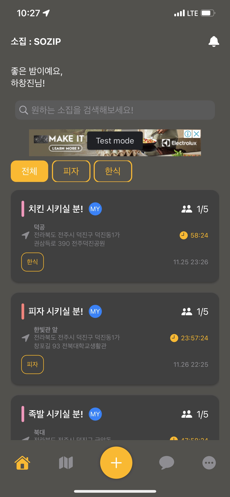
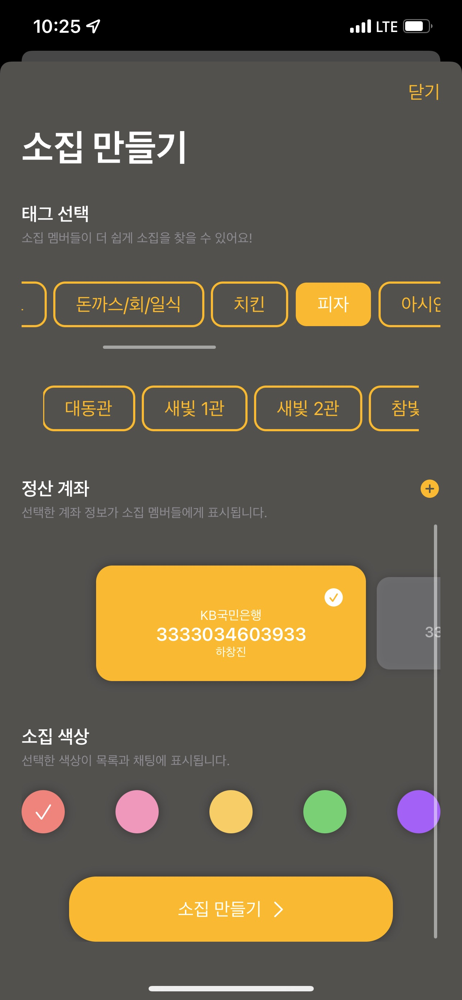
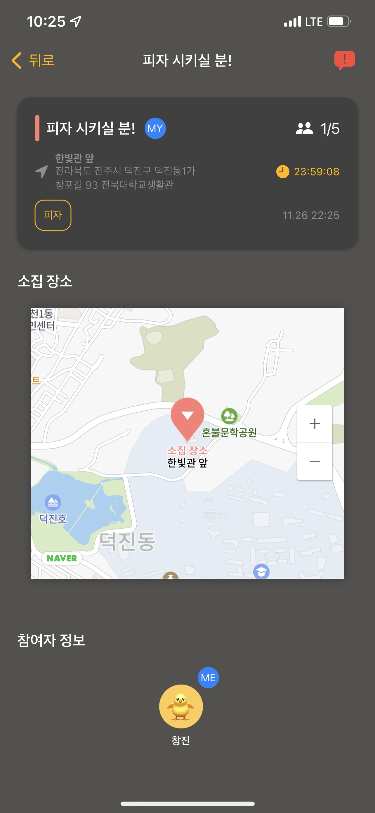
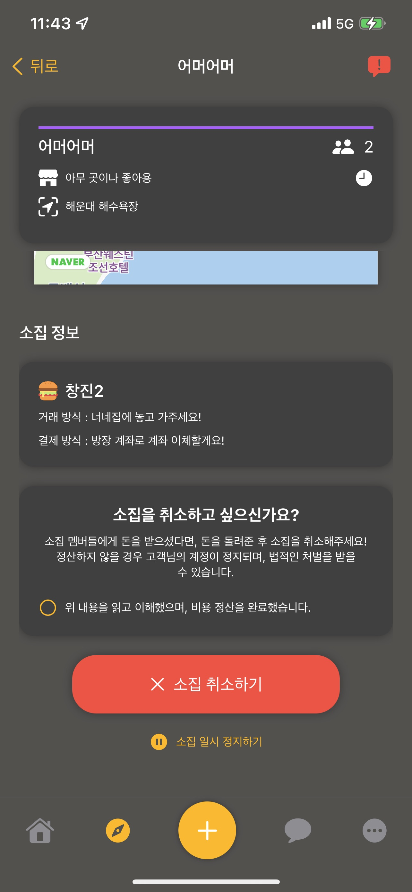

####Wherever you want, feel free to meet.

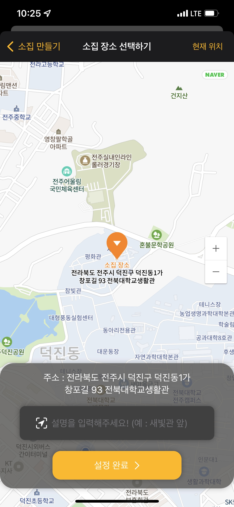
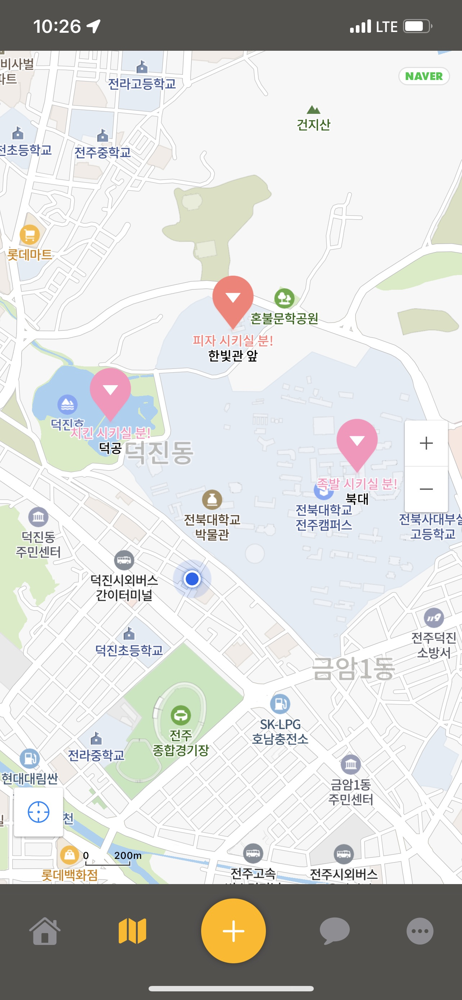

####Don't know what menu there is? Please add the URL of the delivery app for participants!

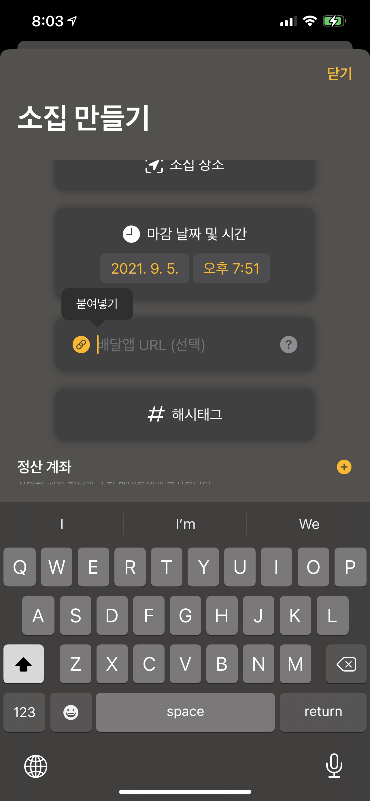

####From Real-time anonymous chatting, to paying : it's neat.

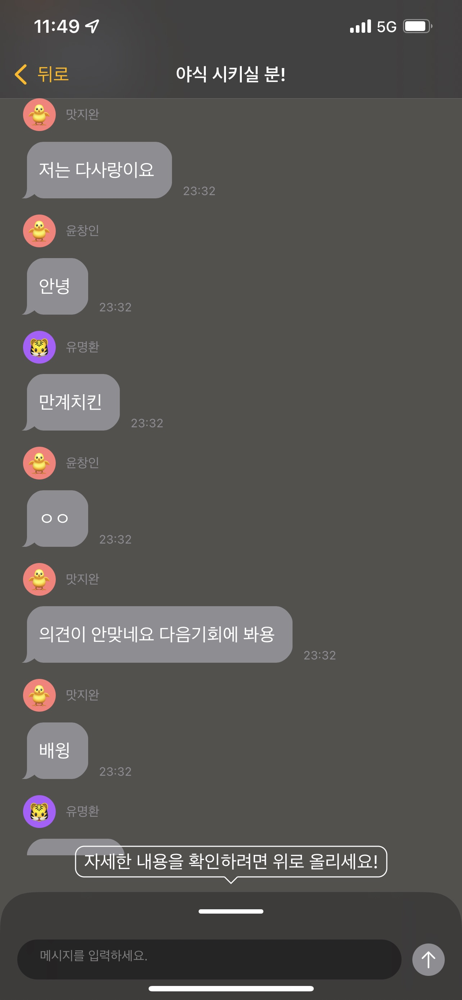
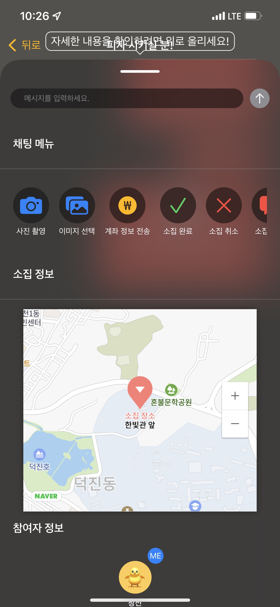
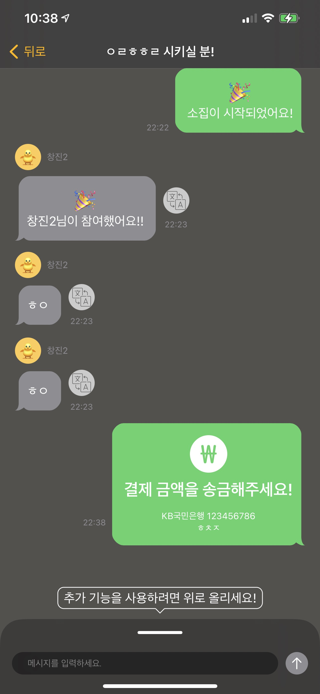
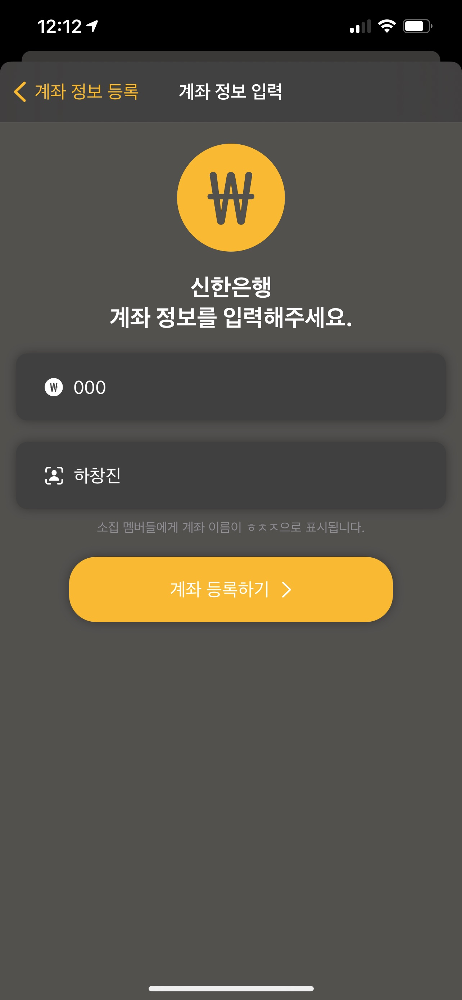

####Show others your unique personality in your profile

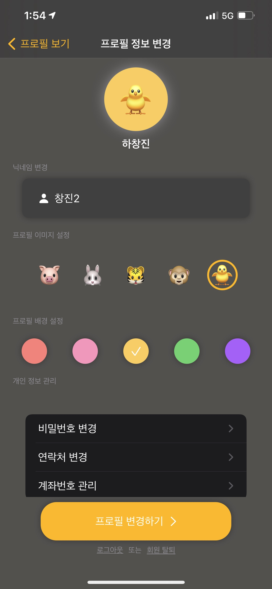
