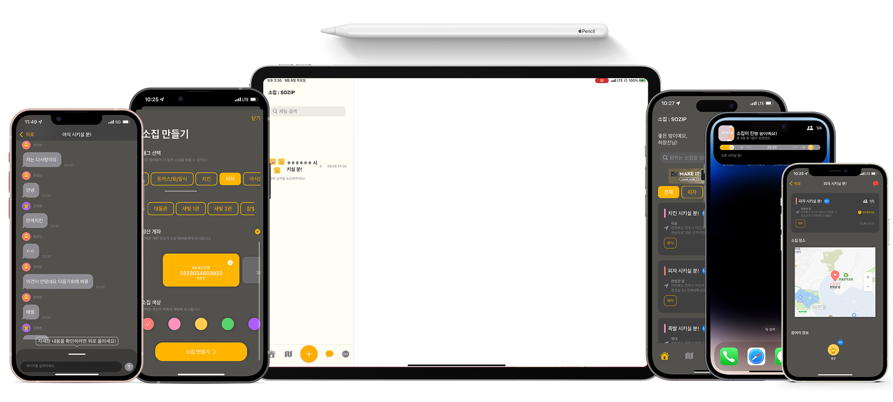 

소집 : SOZIP
=====
> An application for Delivery Cost Dutch Pay 

###### '소집(SOZIP) means to gather (people, etc.) in Korean.'

ⓒ 2021 Changjin Ha, Sojung Moon. All rights reserved.

## 🚀 Tech Stack

### Client (iOS)

</a>
</a>
</a>

### Backend (BaaS & Serverless)

- Firebase Firestore: Realtime chat and sync SOZIP data
- Firebase Cloud Functions: Process backend business logic for reduce client burden
- Firebase Cloud Messaging: Send push notifications to target user when created new SOZIP and chat

### External API

- Naver Maps API (Render location based markers)

## 🏗️ Architecture

graph TD
    %% Client
    subgraph Client [📱 iOS App]
        UI[UIKit / SwiftUI]
        State[State Management]
    end

    %% Backend & Infra
    subgraph Serverless [☁️ Firebase BaaS]
        Auth[Firebase Auth]
        DB[Firebase Firestore]
        Storage[Firebase Storage]
        Funcions[Firebase Cloud Functions]
        FCM[Firebase Cloud Messaging]
    end

    %% External API
    subgraph External [External APIs]
        Map[Naver Maps API]
    end

    %% Data flow
    UI <--> State
    State <--> Auth
    State <--> DB
    State <--> Storage
    State --> Map

    %% Push notifications and BE logic flow
    DB -->|Event Trigger| Functions
    Functions -->|Send Push Request| FCM
    FCM -.->|Push Notification| UI

## 🧱 If I were to rebuild it in 2026

| Layer | Original | 2026 Pick | Reason |
|---|---|---|---|
| UI | Swift UI + UIKit App Delegate | SwiftUI + `@main App` struct only | AppDelegate is only needed for Firebase setup; `FirebaseApp.configure()` can move to the `App` initializer |
| State Management | `ObservableObject` + `@ObservedObject` passed via init | `@Observable` macro (Swift 5.9) + `@Environment` | Less boilerplate, no need to pass helpers through every init |
| Async | Completion handlers | `async/await` + `AsyncStream` for Firebase listener | Linear, readable, type safe |
| Image loading | SDWebImage + SDWebImageSwiftUI | `AsyncImage` | Remove 2 deps |
| JSON parsing | SwiftyJSON | `Codable` | No extra dep, first-party |
| Credentials storage | UserDefaults (encrypted) | Firebase Auth session persistence only | Don't store credentials at all |
| Auth state observation | Manual callbacks | `Auth.auth().authStateDidChangePublisher()` or `Asyncstream` | Reactive, no polling |
| Firebase SDK | Pinned to `master` branch | Pinned to release tag | Build stability |
| Error handling | `String?` completion codes (`"success"`, `"error"`) | `Result<T, AppError>` or `throws` | Type-safe, exhaustive |
| Testing | None | XCTest unit tests for Helper layer + Swift Testing framework | Required for financial logic |

## ✨ Core Features 

Show Contents

#### Home 
> Check any SOZIPs near by you, or notifications  

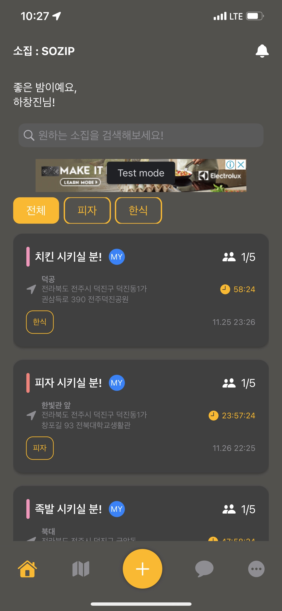 

#### SOZIP Map 
> Check and contact to all SOZIPs  

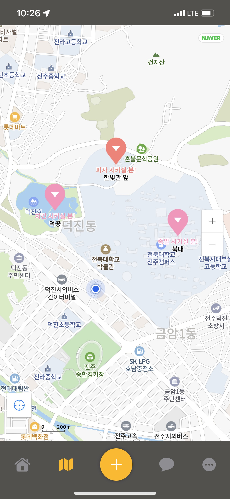 

#### SOZIP 
> Check location, participants, or manage your SOZIP in SOZIP Details 

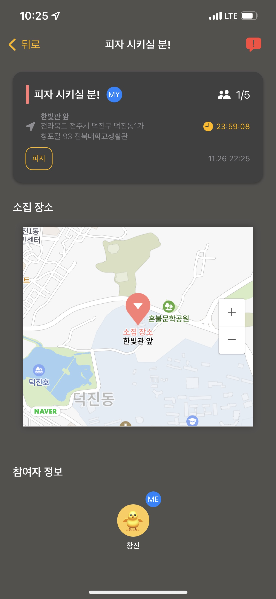 
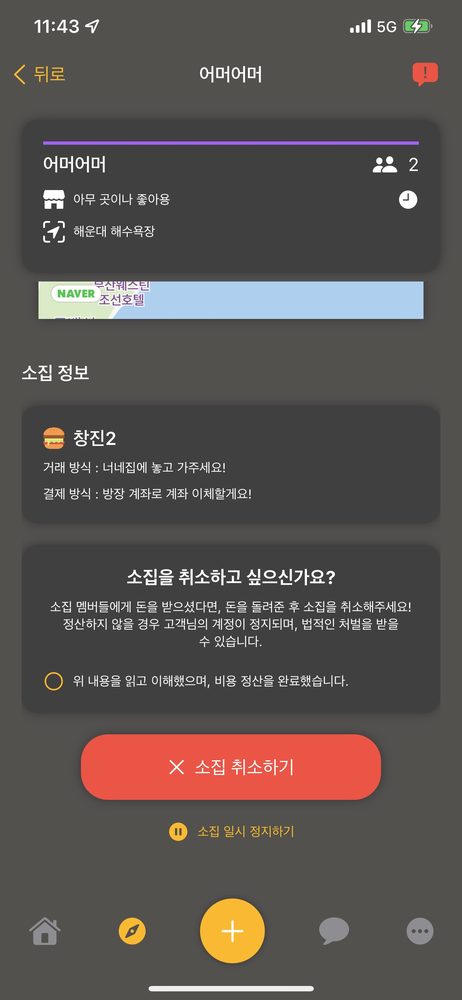 

> Don't you have a favorite SOZIP? Feel free to make it! 

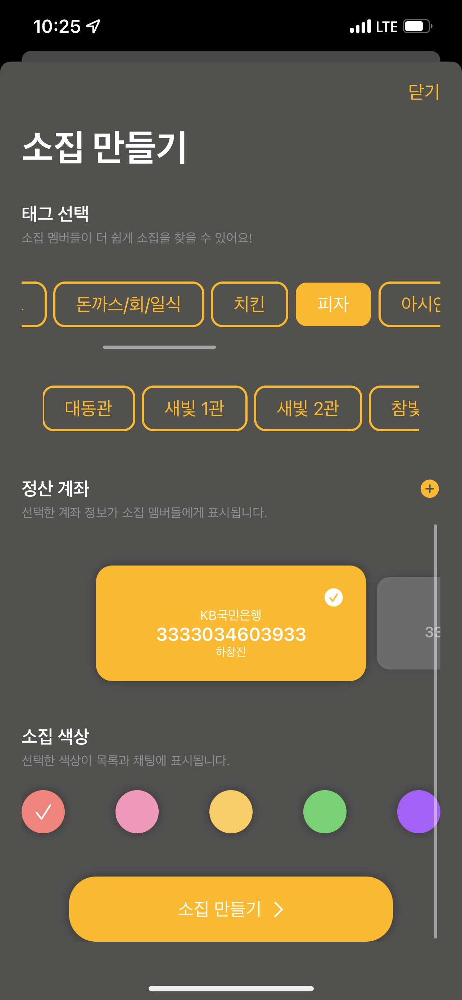
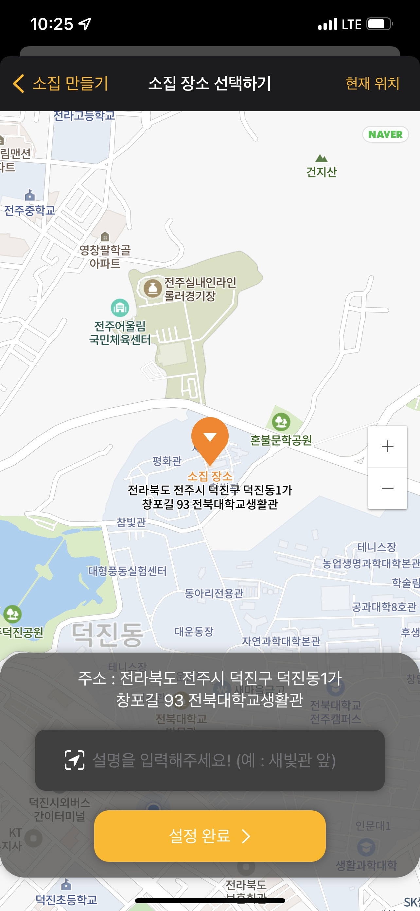 

#### Chat 
> Feel free to talk to the participants  

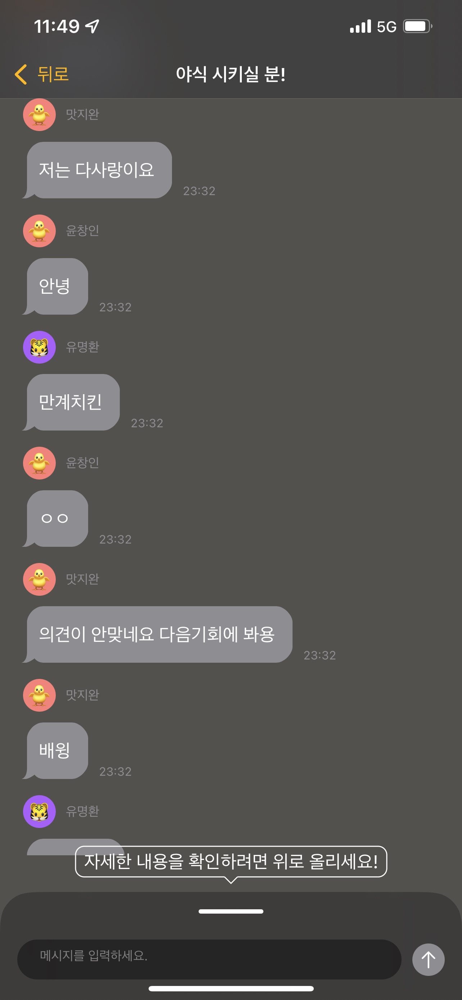 

> Or you can send any images, bank accounts, or manage your SOZIP. it's so easy.  

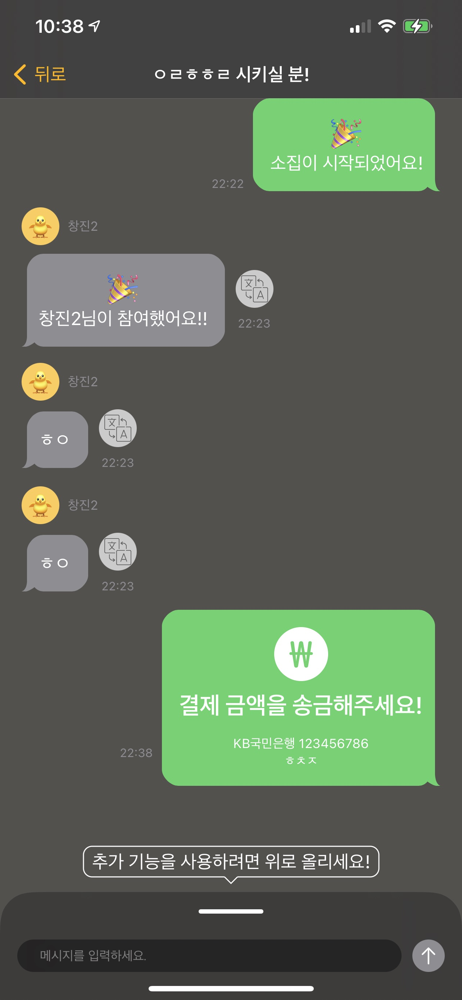
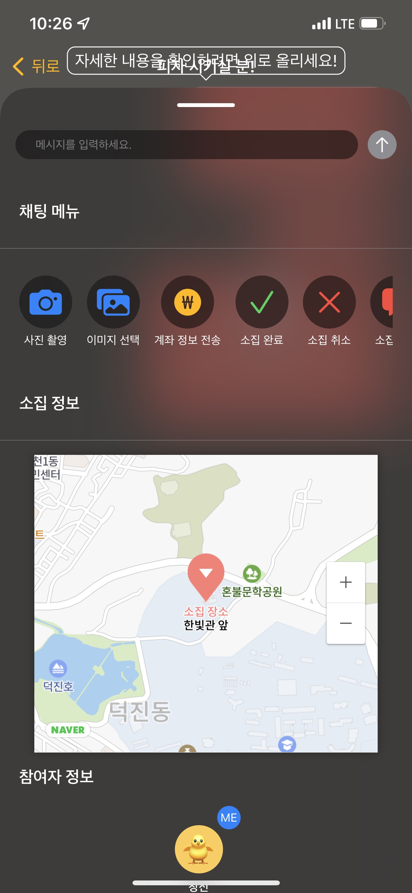 

#### Profile 
> Show others your unique personality in your profile  

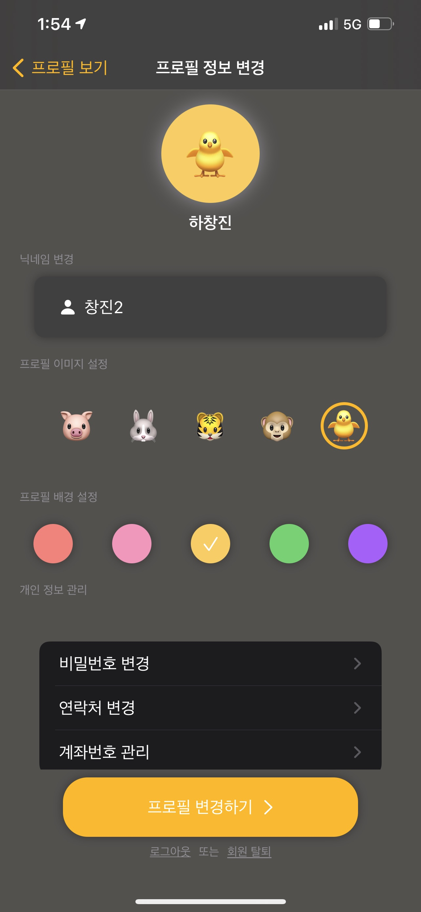 

#### Consulting 
> Are you experiencing any problems using SOZIP? Feel free to contact us!  

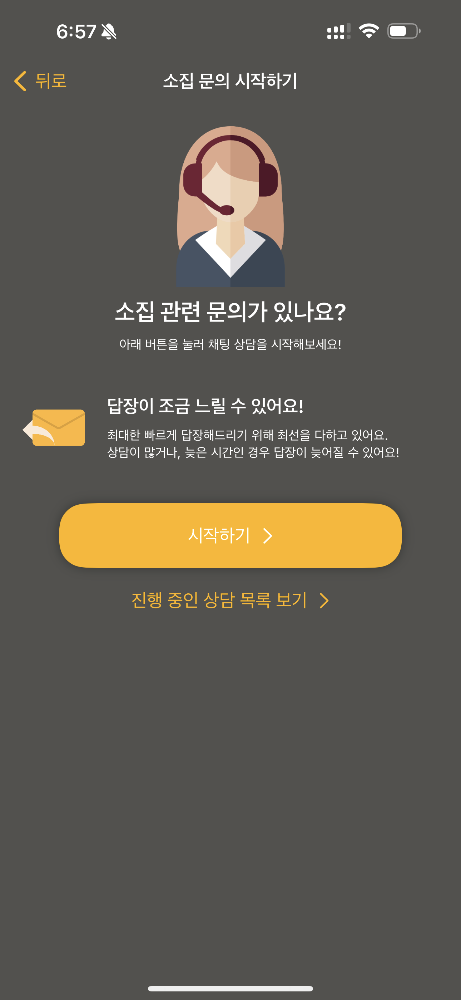
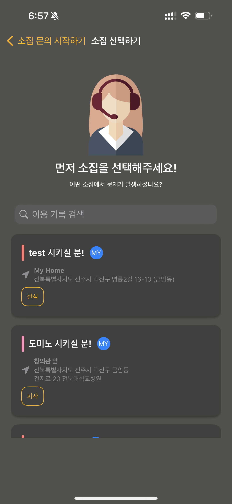
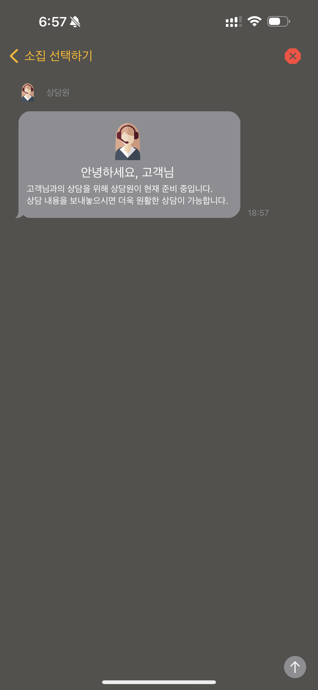 

#### Feedback Hub 
> Improve 소집 : SOZIP with your opinion.  

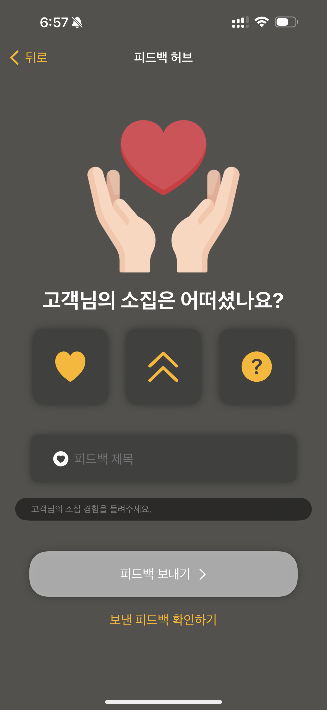 

